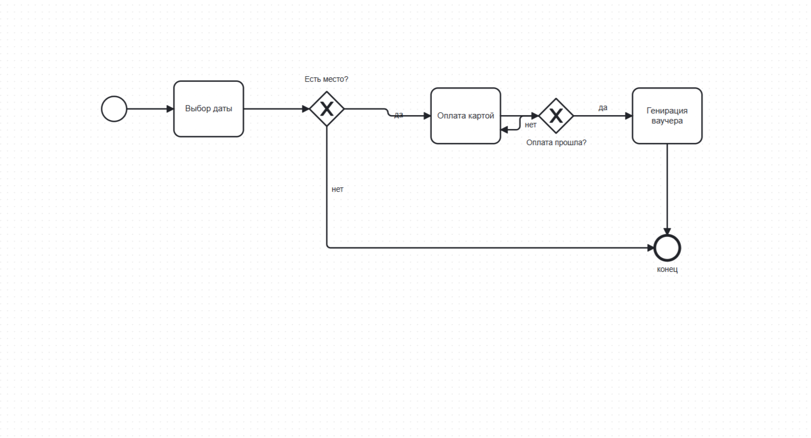
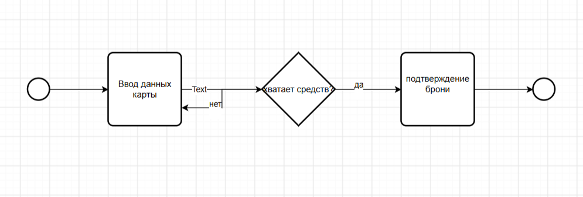

# Отчет по лабораторной работе №1
Тема: Моделирование процессов с использованием Git и визуальных нотаций  
Студентка: Макей София  
Группа: 2 курс, факультет математики и информатики (ГрГУ)

---

## 1. Описание выбранного процесса
Я выбрала бизнес-процесс «Онлайн-бронирование номера в отеле».
Процесс включает в себя: выбор дат клиентом, проверку доступности мест в базе отеля, ввод паспортных данных, проведение оплаты через банк, формирование электронного ваучера и фиксацию брони администратором.

---

## 2. Разработанные диаграммы

### 2.1. BPMN-диаграмма (Основной процесс)
Файлы в репозитории: diagrams/process.bpmn и diagrams/process-bpmn.png  

### 2.2. UML Activity Diagram (Детализация шага проверки)
Файлы в репозитории: diagrams/activity.drawio и diagrams/activity-uml.png  

### 2.3. Sequence Diagram (Взаимодействие участников)
Файл в репозитории: docs/sequence.md

### 2.4. Flowchart (Алгоритм бронирования)
Файл в репозитории: docs/flowchart.md

---

## 3. Сравнение версионирования (git diff)
Чтобы проверить, как Git отслеживает изменения, я добавила новый шаг («Отправка SMS с кодом брони») в схему BPMN и проверила файлы:
* В текстовом файле .bpmn Git сработал идеально: он показал зеленым цветом конкретные строчки добавленного XML-кода (теги новой задачи и стрелки). То есть Git понимает структуру файла.
* Для картинки .png Git просто вывел надпись Binary files differ. Картинка — это бинарный файл, поэтому Git не может показать, что именно на ней дорисовали. 

---

## 4. Выводы
В ходе выполнения работы я научилась работать с консолью Git: создавать репозитории, добавлять файлы, делать осмысленные коммиты и отправлять их на GitHub.

Также я попробовала разные способы моделирования бизнес-процессов: графические редакторы для BPMN и UML, и текстовое описание схем через язык Mermaid. Главный вывод: хранить схемы в текстовых форматах (XML или код) намного надежнее, так как это позволяет легко отслеживать истор